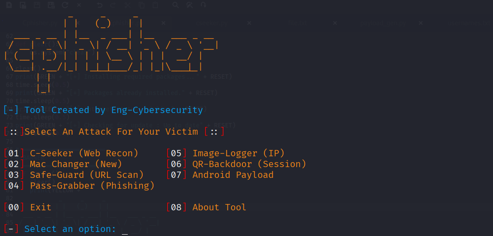

# 🛡️ Cphisher v2.3.5
**Advanced All-in-One Cybersecurity Toolset for Kali Linux**

---
## 📸 ScreenShot


---

## 🛠️ الأوات المتوفرة (Features)
تتضمن هذه الأداة عدة وحدات قوية للاختبار الأمني:

* **🔍 C-Seeker**: فحص المسارات المخفية والـ Subdomains.
* **🔌 Mac-Changer**: تغيير عنوان الماك للحفاظ على الخصوصية.
* **🖼️ Img-Logger**: تتبع الـ IP عبر روابط الصور.
* **🔑 Pass-Grabber**: أدوات فحص كلمات المرور.
* **📱 Payload-Gen**: إنشاء حمولات للاختبار الاختراق.

---

## 🚀 طريقة التثبيت (Installation)
افتح التيرمينال في كالي ونفذ الأوامر التالية بالترتيب:

```bash
# 1. تحميل الأداة
git clone [https://github.com/nymws750-star/Cphisher.git](https://github.com/nymws750-star/Cphisher.git)

# 2. الدخول للمجلد
cd Cphisher

# 3. منح صلاحيات التشغيل
chmod +x Cphisher.py

# 4. تثبيت المكتبات المطلوبة
pip install -r requirements.txt

# 5. تشغيل الأداة
python3 Cphisher.py
